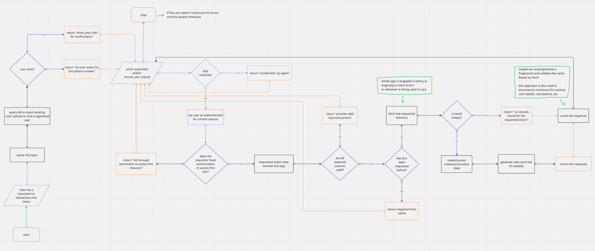
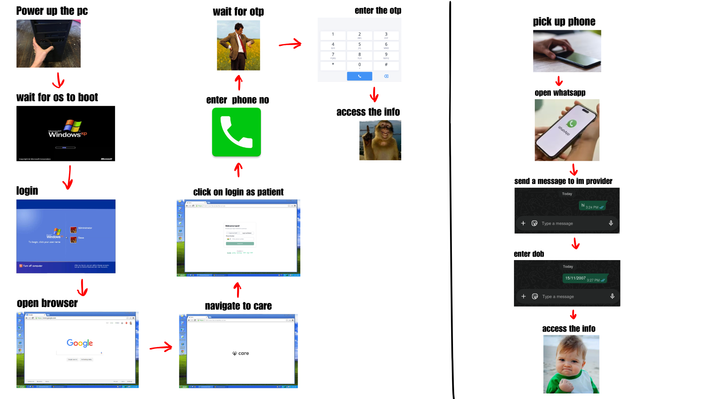

# IM Wrapper Proposal with POC

<table>
    <thead>
        <tr>
            <th width="203">Personal Details</th>
            <th>Description</th>
        </tr>
    </thead>
    <tbody>
        <tr>
            <td><strong>Name</strong></td>
            <td>Samiullah Javed</td>
        </tr>
        <tr>
            <td><strong>Organisation Details</strong></td>
            <td>College: Islamia Govt. Science College Sukkur Program: Computer Science Grade: 12th Expected Graduation Date: June 2026</td>
        </tr>
        <tr>
            <td><strong>Contact Details</strong></td>
            <td>Phone No: +92 326 3672475  Email ID: samiullahjavedd@gmail.com</td>
        </tr>
        <tr>
            <td><strong>Current Timezone</strong></td>
            <td>Pakistan Standard Time</td>
        </tr>
        <tr>
            <td><strong>Github Profile</strong> </td>
            <td><a href="https://github.com/8sami">https://github.com/8sami</a></td>
        </tr>
        <tr>
            <td><strong>Linkedin Profile</strong></td>
            <td><a href="https://www.linkedin.com/in/samiullahjaved">https://www.linkedin.com/in/samiullahjaved</a></td>
        </tr>
        <tr>
            <td><strong>Resume</strong></td>
            <td><a href="https://samiullahjaved.com/Samiullah_Javed.pdf">https://samiullahjaved.com/Samiullah_Javed.pdf</a></td>
        </tr>
        <tr>
            <td><strong>Portfolio Website</strong></td>
            <td><a href="https://samiullahjaved.com">https://samiullahjaved.com</a></td>
        </tr>
    </tbody>
</table>

#### Project Proposal

* **Title**: Whatsapp bot for CARE
* **Project Overview**:
    IM wrapper is a djano plugin based instant messaging provider meant to provide staff and patients ease of access to medical data through any messaging app, quickly and securely. Additionally, it also aims to add functionality of sending alerts and notifications via the configured messaging providers.

    Although the care web app already provides all the information, but people such as those living in rural/remote areas could greatly benefit from accessing their medical records and appointments through a simple message on WhatsApp instead of having to navigate a web app which could prove difficult for people with limited digital exposure.

    The provider approach makes the instant messaging functionality independant of any messaging app, ensuring each one's support can be developed, maintained and tested without intefering with other messaging provider's implementation.

    Developing it as a plugin ensures that we wont have to worry about it interfering with care's backend. As a plugin, it can be removed, added, updated any time without affecting the core backend. This keeps the core backend clean and lean which ensures good maintainability and good developer experience.

    **Specification:**
    1. **Architecture**: Plugin based, using the [django plugin cookiecutter template](https://github.com/ohcnetwork/care-plugin-cookiecutter).
    2. **Authentication**: Two step authentication; first step is matching the requestor's phone number with the number associated with a patient or staff member in the database. The second step is asking for DOB to confirm identity. If the requestor fails to provide correct DOB within 3 attempts, the request is blocked for 15 minutes.
    3. **Authorization**: The authorization is managed via the type of account (staff, patient etc) and roles permissions (RBAC) logic in the care backend. For example a patient can only access their own data, while staff can access the data of patients.
    4. **Caching**: Implemented using Redis through django-redis to reduce latency and database load, with configurable TTL.
    5. **Rate Limiting**: Rate limiting and debouncing of message requests to prevent spam, abuse and overspending credits.
    6. **Error Handling**: Proper error handling following care's implementation and guidelines.
    7. **Audit Logging**: Audit logging using the existing care.audit_log package of all important events.
    8. **Frontend**: The frontend of the plugin will be developed using [care_hello_fe](https://github.com/ohcnetwork/care_hello_fe) to allow requestors to download PDFs and (maybe) for rendering content too long to be sent as messages. Will also provide staff with ui to send out notifications and alerts.
    9. **Notification**: Functionality to send alerts and notifications to staff and patients via configured messaging providers as background tasks.
    10. **Testing**: Proper tests using pytest and coverage, using existing Makefile targets (eg, test and test-coverage) and playwright for frontend plugin testing.
    11. **Documentation**: Documentation using sphinx and api documentation via swagger.
  
    **Flow of Program:**
    This flowchart helps illustrates a high level flow of program of the IM Wrapper (excluding the alert functionality):

    

    **Notification Implementation:**  <!-- modify this -->
    To handle alerts like appointment reminders without blocking the main thread, the plugin will rely on CARE's existing Celery setup. 

    The flow is pretty straightforward: we listen to django signals (like post_save on PatientConsultation or Appointment) which trigger a background Celery task. This task calls a send_notification method in the IM Wrapper. Since we are using a provider-based architecture, this method just formats the payload and sends it off, regardless of whether it's hitting Meta's WhatsApp API or Twilio. If the provider API rate-limits us or goes down, Celery's retry mechanism kicks in with exponential backoff so we don't drop messages.

    **Proof of Concept:**
    To support my claims and get hands on experience, I developed a working prototype of the IM Wrapper as a django plugin using the [django plugin cookiecutter template](https://github.com/ohcnetwork/care-plugin-cookiecutter) with the help of AI.

    My plan was to architect it as an IM provider which could be extended to support any messaging app. Since it's a proof of concept, I implemented the patient side of things and the WhatsApp provider only. There are many things that could have been done better and many things are intentionally kept simple, but I believe it is somewhat successful in properly conveying my ideas.
    
    Below is the list of things I focused on implementing for the POC:

    * Implemented the two step auth, in which the first step verifies the requestor's phone number with the number associated with a patient in the db. The second step asks for DOB to confirm identity. 
    
        If the requestor fails to provide correct DOB within 3 attempts, all requests from that number are blocked for 15 minutes.
    * Proper state management is implemented so that the 'bot' is fool-proof and somewhat context-aware.
    * Caching with configurable TTL is also implemented. 
    * The plugin is using care.audit_log package to log all the events to comply with HIPAA security regulations.
    * Fetches live data instead of returning dummy data from faker.
    * Data sanitization is also implemented to prevent sending irrelevant sensitive information that could put PII of patients at risk.

    Below are the links to the Github repo and a YouTube video demonstration of the POC:

    * **Github repo**: [https://github.com/8sami/im_wrapper_poc](https://github.com/8sami/im_wrapper_poc)
    * **YouTube video**: [https://www.youtube.com/watch?v=wKRil3z-d5s](https://www.youtube.com/watch?v=wKRil3z-d5s)

    **Additional Information:**
    * The word "WhatsApp" can be used interchangeably with any or all of the messaging apps/provider that could be integrated in the plugin in the future.
    * During the development of POC, I had AI create me [im_wrapper_setup.sh](https://github.com/8sami/gsoc-proposal/blob/main/media/im_wrapper_setup.sh) script to help automate the setup and running of the development environment (which had started to become annoying doing daily, manually).

        The script [im_wrapper_setup.sh](https://github.com/8sami/gsoc-proposal/blob/main/media/im_wrapper_setup.sh) pulls the latest changes from origin develop, rebuilds containers, loads fixtures, logins as admin, creates a service account, generates service account token, creates a read only role and assigns it to the service account, gets all organizations and assigns the service account to them, then updates the service account token and username in plug_config.py and then starts up ngrok on port 9000.
    * I have also put together [plugin_setup.md](https://github.com/8sami/gsoc-proposal/blob/main/media/plugin_setup.md) to help with the setup of the POC plugin.
    * A few thoughts I had during the development of POC:
        * I wonder if the IM wrapper plugin will also need a frontend implementation (just like [scribe_fe](https://github.com/ohcnetwork/care_scribe_fe)) for providing users with the ability to download PDFs of invoices, medications etc, as sending these PDFs via WhatsApp might not be a good idea.
        * Will surely need a frontend implementation to be able to send notifications and alerts to patients and staff or maybe we could add a staff-only option to allow them to do this just by messaging the 'bot'.
        * Since each encounter (visit) can have different medications and service requests etc, will it make more sense to prompt user to select an encounter when they message the plugin for, let's say, medications (if a patient has multiple encounters) or instead, just list out all the medications of all the encounters (as it currently does in the POC)?
        * I was also thinking of implementing a one-time otp verification, just to be extra careful, but since we will be matching the requestor's phone number against the patients in the db and the requestor will already have access to that phone number; it will just be an additional unnecessary cost.
        * I had also planned to support view-once links for PDFs and other stuff but since the care web app doesn't support it, I dropped that idea too. 
        * What should happen if a staff member is also registered as a patient using the same phone number? I faced this scenario while testing the POC and wasn't sure how to handle it.
        * I was also wondering about what could be the best way to handle long messages, such as those exceeding 4,096 characters.

    **Use Cases**:
    1. Since care provides teleICU services to many remote areas of India, it makes a lot of sense to provide ease of access to medical data to the people living in those areas where issues like internet connectivity, digial literacy and lack of access to computers are prevalent.
    2. Using messaging apps like WhatsApp is more comfortable and easier to use for people because of its familiarity than navigating a web app, which can be daunting for some.
    3. Accessing information via WhatsApp is much more convenient and faster than having to log in to the care web app.

        The image below aims to depict the time it may take to access information via both methods by showing the difference in number of steps:

        

* **Features**: <!-- modify this -->
  1. **The Plugin Architecture**: It keeps the core codebase clean and makes it really easy to add new features without worrying about breaking existing implementations.
  2. **Async Tasks using Celery**: It's great how background tasks like generating reports or sending emails are offloaded, keeping the API fast.
  3. **Role-Based Access Control (RBAC)**: The permission system is very well thought out, ensuring strict boundaries between what a receptionist can see versus a doctor.
  4. **Audit Logging**: The way care.audit_log tracks model changes without cluttering the business logic is really clean, which is essential for HIPAA compliance.
  5. **Type Hints & Test Coverage**: Coming from a Typescript background, seeing extensive type hinting and a solid pytest suite makes the repository much easier to navigate and contribute to.

#### Technical Skills and Relevant Experience

* My technical skills include python, javascript, typescript, react, nextjs, django, flask, SQL, git, github, docker, linux
* My first full stack project, "Simple Invoice Generator" was built using django, weasyprint, crispy-bootstrap5 and jinja. That project recorded almost 2 Cr of transactions for a procurement service provider and then as I was developing its v2 using nextjs, shadcn, reactPDF and django ninja the business completed its tenure. I reviewed the code a few weeks ago... it needs a lot of work but I plan to deploy it as a free open source tool this year.

    I have a YOE working as a software dev remotely for an Australian agency where I got the chance to work on production grade code across various projects using different technologies. Working in a high stakes environment has taught me a lot about problem solving while respecting tight deadlines.

#### Implementation Timeline and Milestones
<!-- modify this -->
Taking a 3-phase approach for a 12-week mid-size project, the timeline is structured as follows:

**Phase 1: Backend Architecture & Core IM Integration (Weeks 1-4)**
* **Week 1-2**: Scaffold the django plugin using the cookiecutter template. Implement the two-step authentication system (phone number matching and DOB confirmation) along with retry tracking and rate limiting.
* **Week 3-4**: Establish rule-based authorization workflows aligning with Care's backend permissions. Implement caching logic using django-redis and PlugConfig cache invalidation to minimize database hits. Implement basic messaging flows and data querying logic.
* **Deliverable & Milestone 1**: A functional, secure backend integration capable of serving basic patient queries securely to authenticated users through the IM provider.

**Phase 2: Frontend Plugin & Notification Engine (Weeks 5-8)**
* **Week 5-6**: Develop the care-friendly notification functionality to trigger and dispatch automated alerts and system updates to staff and patients across messaging providers.
* **Week 7-8**: Develop the frontend plugin using [care_hello_fe](https://github.com/ohcnetwork/care_hello_fe). Implement secure, "view once" link generation for downloading sensitive files (eg, invoices and medications) without sending PDFs directly via WhatsApp.
* **Deliverable & Milestone 2**: Fully integrated notification engine and accessible frontend interface for bot management.

**Phase 3: Refinement, Audit Logging & Delivery (Weeks 9-12)**
* **Week 9-10**: Deeply integrate the care.audit_log package to thoroughly track HIPAA-compliant events. Add exhaustive unit and integration testing via pytest and coverage, seamlessly orchestrated via Makefile targets, along with playwright.
* **Week 11**: Address edge cases in conversational state management, refine sanitization processes to hide PII and finish writing API and installation documentation via Sphinx.
* **Week 12**: Code cleanup, buffer for final bug fixes, preparation of the final GSoC project report and demo recording.
* **Deliverable & Milestone 3**: A completely tested, documented and secure IM Wrapper system successfully merged and ready for production deployment within the CARE ecosystem.

**Deliverables:** <!-- modify this -->
1. A fully functional django plugin acting as the plugin backend.
2. The frontend of the plugin developed using [care_hello_fe](https://github.com/ohcnetwork/care_hello_fe).
3. Proper tests for both the backend and frontend.
4. Documentation of api, plugin backend and frontend both. Along with demonstration videos and guides for setting up and using the plugin.

#### Summary About Me

A short intro of me: [Watch on YouTube](https://youtube.com/shorts/5Gx_Yw9gSZU?si=rSZAJvbkG9n7dxrv) :)

 I am a curious person. I like trying out new stuff and doing things that seem fun to me. Problem solving and product development are one of those things that I very much enjoy doing. I have more than a YOE working as a software developer in an Australian agency where I resigned from in february to explore my interests and focus on my studies to try and get into MIT. I started programming when I was in 9th grade, as it seemed really interesting and its just as fun now as it was back then.

 My motivation for winning gsoc is that it aligns with my goals and I have also developed a love for open source in the process. I genuinely enjoy contributing to something bigger than me, something that would go on to live and make people's lives easier even after me.

#### Availability and Commitment

* 40-50 hours per week
* I'll be studying for SAT and training for national powerlifting competition for 2-3 hours daily. Will be done with Board exams by 25 april 2026 and I won't be preparing for entrance exams until next year so I am totally available to see this project till the end (and beyond).

#### Contribution to OHC Repo (if applicable)

* **Pull Requests**:
  1. <https://github.com/ohcnetwork/care_fe/pull/16144>
  2. <https://github.com/ohcnetwork/care_fe/pull/16086>
  3. <https://github.com/ohcnetwork/care_fe/pull/16085>
  4. <https://github.com/ohcnetwork/care_fe/pull/15828>
  5. <https://github.com/ohcnetwork/care_fe/pull/15546>
  6. <https://github.com/ohcnetwork/care_fe/pull/15454>
  7. <https://github.com/ohcnetwork/care_fe/pull/15098>

* **Issues**: 
  1. <https://github.com/ohcnetwork/care_fe/issues/15719>
  2. <https://github.com/ohcnetwork/care_fe/issues/15494>

* I am not sure if I should mention this, but I lowkenuinely really love guiding and helping other people out in the community :D